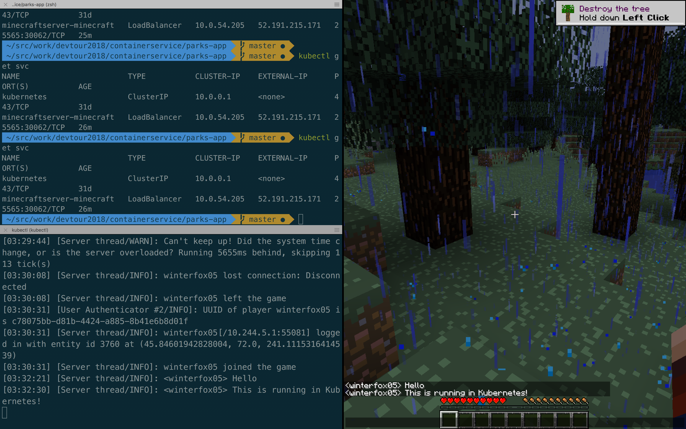

# Azure Container Service (AKS)

AKS is a managed Kubernetes cluster. We provide standard open-source Kubernetes, but operating system upgrades and security patches are performed for you. Use all your standard Kubernetes tools and workflows without having to worry about operating the cluster. The Kubernetes master ("control plane") is free. You pay only for each worker node.

### Table of contents
- [Creating AKS clusters](#creating-aks-clusters)
- [Modifying an existing AKS cluster](#modifying-an-existing-aks-cluster)
- [Using the Kubernetes client](#using-the-kubernetes-client)
- [Deploying applications with Helm](#deploying-applications-with-helm)
- [Service Catalog & Open Service Broker for Azure](#service-catalog-and-open-service-broker-for-azure)
- [Draft: Streamlined Kubernetes Development](#draft)


## Creating AKS clusters

### Creating a standard AKS cluster

```
az aks create -g containergroupeast -n MyK8s --generate-ssh-keys --kubernetes-version 1.9.2 --dns-name-prefix mk8s
```

### Creating an AKS cluster with custom VM sizes and specific worker node count

```
az aks create -g containergroupeast -n MyK8s --generate-ssh-keys --kubernetes-version 1.9.2 --dns-name-prefix mk8s --node-vm-size Standard_DS1_v2 --node-osdisk-size 100 --node-count 9
```

### Install the Kubernetes client
You can either download this from kubernetes.io, or run
```
az aks install-cli
```

### Getting your Kubernetes credentials (kubeconfig) for use with the Kubernetes client

```
az aks get-credentials -g containergroupeast -n managedkube
```

You are now ready to use Kubernetes with the standard Kubernetes tools and commands.

---

## Modifying an existing AKS cluster

It is simple to scale or upgrade your AKS  clusters.

### Scaling your AKS cluster (increase number of worker nodes)

```bash
az aks scale -g containergroupeast -n managedkube --node-count 4
```

### Get all available upgrades for your cluster:
```
az aks get-upgrades -g containergroupeast -n managedkube -otable
```

Example output:
```
Name     ResourceGroup       MasterVersion    NodePoolVersion    Upgrades
-------  ------------------  ---------------  -----------------  --------------
default  containergroupeast  1.9.2            1.9.2              None available
```

### Upgrading to a particular Kubernetes version

```
az aks upgrade -g containergroupeast -n managedkube --kubernetes-version 1.9.2
```

---

## Using the Kubernetes Client

### Viewing resources
Let's take a look at some of our existing resources.

```
kubectl get pods --all-namespaces
```

```
kubectl get services --all-namespaces
```

### Running a job

> Once again we'll use the Parks demo app and our PostgreSQL database. Kubernetes configuration files can be found in the `parks-app` folder.

This demo requires we first create a **Kubernetes secret**. Run `prepare-secrets.sh` to create a secrets file `secrets.env` with the database connection info.

```bash
# Create the Kubernetes secret
kubectl create secret generic parks-secret --from-env-file='secrets.env'

# Checking the secret
kubectl describe secret parks-secret
```

Now we are ready to create our job.

```bash
# Deploying a Kubernetes job
kubectl create -f job.yaml

# Checking the job status
kubectl describe job parks-dbinit

# Streaming the logs of our job
kubectl logs job/parks-dbinit --follow=true

# Deleteing the job
kubectl delete job parks-dbinit
```

### Creating a deployment

> Once again we'll use the Parks demo app and our PostgreSQL database. Kubernetes configuration files can be found in the `parks-app` folder. We will also use the `parks-secret` **secret** from the previous section.

```bash
# Creating the deployment
kubectl create -f deployment.yaml

# Check the status of the deployment
kubectl get deployments

# Look at the pods for your deployment
kubectl get pods -owide
```

Right now our application is only accessible inside of the Kubernetes cluster. Let's simply forward the port. We will also stream deployment logs.

> Open two terminals

```bash
# Terminal 1: Forward cluster internal port to local port
kubectl port-forward deployment/parks-deployment 8080:80
```

```bash
# Terminal 2: Stream logs from all pods of our deployment
kubectl logs deployment/parks-deployment --follow=true
```

If desired we can scale our deployment to more pods.

```bash
kubectl scale deployments/parks-deployment --replicas=5
```

Now we can view our app at http://localhost:8080/. Notice that logs are being streamed!

Finally we can tear everything down via:
```bash
kubectl delete deployment parks-deployment
kubectl delete secret parks-secret
```

---

## Deploying applications with Helm

Helm is an open-source package manager for Kubernetes. Instead of individual components and microservices, Helm allows managing of entire applications designed for Kubernetes. It is available at https://helm.sh.

### Demo Available Public Charts

Visit https://hub.kubeapps.com/

### Deploy a Minecraft server

Chart: https://hub.kubeapps.com/charts/stable/minecraft

This helm chart provides several features such as persistent data for the state of the Minecraft world.

```bash
helm install --name awesomeserver \
--set minecraftServer.eula=true,minecraftServer.Difficulty=hard \
stable/minecraft
```

Check  status:
```bash
helm list
kubectl get po,svc,deployments

# Wait for load balancer IP
kubectl get svc -w
```

Open another terminal to stream logs
```bash
kubectl logs deployment/awesomeserver-minecraft --follow=true
```

Launch Minecraft and start a Multiplayer game with the server IP received above.

Once in game, press the `t` key, type a message and press `ENTER`. The chat message will also appear in the Kubernetes logs.



---

## Service Catalog and Open Service Broker for Azure

Cloud Foundry has a concept called `Service Brokers` which allow provisioning of external services such as databases and then exposing these to app deployments. This concept was generalized in the `Open Service Broker` initiative.

In Kubernetes, `Service Catalog` is the in cluster service where different service brokers based on open service broker can be registered.

We have an Open Service Broker for Azure (OSBA) which works with Kubernetes, OpenShift, CloudFoundry and soon ServiceFabric.

Instructions for installing Service Catalog and OSBA in Kubernetes can be found [here](https://github.com/Azure/open-service-broker-azure/blob/master/docs/quickstart-aks.md).


### Installing a Helm Chart which uses OSBA

Azure specific helm charts can be found at: https://github.com/Azure/helm-charts

```bash
# Add the Azure Helm charts
helm repo add azure https://kubernetescharts.blob.core.windows.net/azure
```

```
# This would take 6-10 minutes

helm install azure/wordpress --name azurewordpress --namespace osba-demo
```

This provisions an Azure database for MySQL in a resource group called `osba-demo` (matching the namespace) in the same region as your AKS cluster (here `eastus`).

You can view this database via:
```
az resource list -g osba-demo -otable
```

---

## Draft

Draft is an open source tool developed by Deis (acquired by Microsoft) that makes iterative application development for and deployment into Kubernetes easier. Under the hood it relies on Helm to install your application. Draft is available at https://draft.sh/.

> **Note:** Draft behavior changed in the latest version. Make sure to use 0.11 for this demo. Grab version 0.11 of draft [here](https://github.com/Azure/draft/releases/tag/v0.11.0).

### Setting up Draft

If you haven't done so, create an Azure Container Registry
```bash
az acr create -g containerdemogroup -n mycontainerdemoregistry --sku Basic --admin-enable true -l eastus
```

Store the ACR credential in variable `$acrpassword`.
```bash
az acr credential show -n mycontainerdemoregistry --query="[passwords[0]][0].value" -otsv | read acrpassword
```

Now copy the contents of `$acrpassword` to the clipboard. On Mac you can do `echo $acrpassword | pbcopy`.

Initialize draft and install the in cluster component:
```bash
# container registry
# server: mycontainerdemoregistry.azurecr.io
# user: mycontainerdemoregistry
# password: ***************** paste from clipboard

draft init --upgrade
```

### Using Draft

We will use the sample Python Flask web app in the [draft-sample](./draft-sample) folder.

Create a Helm Chart via `draft create`:
```bash
draft create
```

Now deploy the app.
```bash
draft up
```

The application code and chart are uploaded to your Kubernetes cluster. There the Docker image is built and then published to ACR. Finally, the helm chart is being installed.

View the helm release
```
helm list --namespace default
```

View the service for our app
```
kubectl get svc
```

Draft conveniently provides a way to connect to this clsuter internal service.
```bash
draft connect
```

The service's port `8080` will not be forwarded to a local random port such as `59226`, making the app available in your browser at http://localhost:59226.

Now let's change our app. Instead of starting `app.py`, let's start `v2-app.py`. Edit the `Dockerfile`.

```bash
sed -i '' 's/app.py/v2-app.py/' Dockerfile
```

Now let's publish our change.
```bash
draft up
```

If you observe the pods, you can see Kubernetes performing a rolling upgrade.
```
kubectl get po -w
```

Finally view the new version with `draft connect`.
```bash
draft connect
```

## Bursting with Azure Container Instances using Virtual Kubelet

This section largely imitates the steps from the [Virtual Kubelet for ACI](https://github.com/virtual-kubelet/virtual-kubelet/tree/master/providers/azure) instructions.

**WARNING:** Currently the easy step does not work. You need to complete the manual ***virtual kubelet*** installation (create a new resource group, provision a service principal, then install the helm chart specifying the resource group, service principal credentials etc)

```bash
az aks install-connector -g containergroupeast -n managedkube --connector-name infinitypool
```

This will register the virtual node.

```bash
kubectl get nodes

# output will look like follows:

NAME                                 STATUS    ROLES     AGE       VERSION
aks-nodepool1-32072832-0             Ready     agent     9d        v1.9.2
aks-nodepool1-32072832-1             Ready     agent     9d        v1.9.2
aks-nodepool1-32072832-3             Ready     agent     9d        v1.9.2
virtual-kubelet-infinitypool-linux   Ready     agent     11s       v1.8.3
````

The interesting thing is that we will not be scheduling pods on our virtual node by default as this note is **tainted**.

```bash
kubectl describe node virtual-kubelet-infinitypool-linux | grep "Taints" --color=auto

Taints:             azure.com/aci:NoSchedule
```

To schedule pods on this node we need to add a **toleration**.

```yaml
  tolerations:
  - key: azure.com/aci
    effect: NoSchedule
```